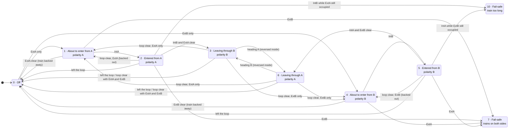
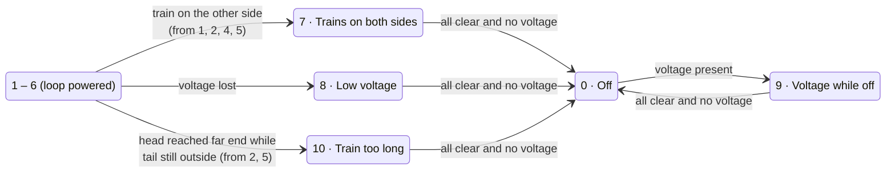

# Otter KehrschleifenBaustein — Firmware

ESP32 firmware for the Otter model railroad control system. Each board runs exactly one KehrschleifenBaustein (reversing-loop module), which switches track polarity via its bistable relays (K1/K2) and reports/controls state over WiFi and MQTT.

**Status: work in progress.** The occupancy sensing, loop-voltage measurement, the [state machine](#state-machine) in [main/kb.cpp](main/kb.cpp) and the [OLED display](#display) are implemented; the relay switching and the MQTT publishing of the state are not yet — see the `TODO`s there. Everything else (WiFi/MQTT bring-up, NVS-backed settings, serial console) mirrors the [Otter_VerteilerBaustein](../../Otter_VerteilerBaustein) firmware structure.

## Requirements

- [ESP-IDF](https://docs.espressif.com/projects/esp-idf/en/latest/) v6.x
- Target: ESP32
- IDF components (resolved automatically via `idf_component.yml`):
  - `espressif/mqtt ^1.0.0`
  - `espressif/cjson >=1.0.0~1`

## Build & flash

```sh
# Source the IDF environment (adjust path to your installation)
. ~/esp/esp-idf/export.sh

# First-time setup — set the target chip
idf.py set-target esp32

# Build, flash, and open the serial monitor
idf.py build flash monitor
```

## Configuration

Settings are persisted in NVS and can be changed at runtime via the **serial configuration console** (115200 baud). Compiled-in defaults are defined in [main/settings.cpp](main/settings.cpp).

| Setting | Description |
|---------|-------------|
| `ssid` / `password` | WiFi credentials |
| `mqtt_server` | MQTT broker IP address |
| `client_name` | MQTT client ID |
| `AbschNummer` | Third octet of the static IP |
| `KehrschleifenBaustein` | Fourth octet of the static IP |
| `networkByte1` / `networkByte2` | First two octets of the network address |
| `gatewayByte3` / `gatewayByte4` | Last two octets of the default gateway |
| `MqttExtA` | MQTT topic for external input A (default: `otter/KB/ExtA`) |
| `MqttExtB` | MQTT topic for external input B (default: `otter/KB/ExtB`) |
| `MqttOccupied` | MQTT topic for the loop's occupancy/Besetztmeldung (default: `otter/KB/Occupied`) |
| `MqttVoltage` | MQTT topic for the current loop voltage (default: `otter/KB/Voltage`) |
| `MqttStatus` | MQTT topic for the current Kehrschleifen status (default: `otter/KB/Status`) |

Static IP format: `networkByte1.networkByte2.AbschNummer.KehrschleifenBaustein`

## State machine

The loop logic in [main/kb.cpp](main/kb.cpp) (`calculateKBStatus()`) is a state machine driven by five occupancy detectors and the loop voltage. It is evaluated whenever one of its inputs changes, and once more when the lost-train timeout expires.

### Detector layout

```
 outside          |            inside the loop            |          outside
 ──────  ExtA  ───┼───  IntA  ────  IntM  ────  IntB  ───┼───  ExtB  ──────
                gap A                                   gap B
                (polarity A)                            (polarity B)
```

| Input | Where | Source |
|-------|-------|--------|
| `ExtA` | side A, outside the loop | MQTT topic `MqttExtA` (may arrive with some delay) |
| `IntA` | side A, inside the loop | local sense pin |
| `IntM` | middle, inside the loop | local sense pin |
| `IntB` | side B, inside the loop | local sense pin |
| `ExtB` | side B, outside the loop | MQTT topic `MqttExtB` (may arrive with some delay) |
| `voltagePresent` | inside the loop | local ADC, true above 10 V |

The polarity at gap A must match the outside track whenever a train straddles gap A, and the same holds for gap B. The polarity may therefore only be switched while the train is completely inside the loop (no `Ext` detector occupied) or while the loop is empty.

Because the voltage sensor sits **inside** the loop, it reads 0 V while the loop is switched off. Every state that expects the loop to be powered treats "no voltage" as a fault, and the off state treats "voltage" as a fault.

### States

| # | State | Loop | Polarity |
|---|-------|------|----------|
| 0 | Off, nothing approaching | off | – |
| 1 | Train is about to enter from A | on | A |
| 2 | Train entered from A | on | A |
| 3 | Train leaving through B | on | B |
| 4 | Train is about to enter from B | on | B |
| 5 | Train entered from B | on | B |
| 6 | Train leaving through A | on | A |
| 7 | Fail-safe: trains on both sides | off | – |
| 8 | Fail-safe: low voltage while the loop should be powered | off | – |
| 9 | Fail-safe: voltage present while the loop should be off | off | – |
| 10 | Fail-safe: train too long for the loop | off | – |

States 1–3 and 4–6 are mirror images of each other with A and B swapped.

### Main flow

Transitions are checked top to bottom in the code; the first match wins. The fail-safe transitions to state 8 (loop lost power, from every powered state) and to state 9 (voltage while off, from state 0) are left out of this diagram for readability and shown in the next one.



"Left the loop" means all detectors are clear and no lost-train timeout is pending (see below).

### Fail-safe states



Every fail-safe state returns to *Off* only once all five detectors are clear **and** no voltage is present in the loop, which is exactly the condition under which state 0 is stable.

### Direction detection (reversing trains)

A train may stop and reverse at any moment. The detectors do not report a direction, so it is derived from **edges** — which detector just became occupied or clear — while the train is completely inside the loop:

| A train is heading to **A** when | A train is heading to **B** when |
|---|---|
| `IntA` becomes occupied coming from the middle | `IntB` becomes occupied coming from the middle |
| `IntM` becomes occupied while only `IntB` was occupied | `IntM` becomes occupied while only `IntA` was occupied |
| `ExtB` clears while the loop is still occupied (train came back in) | `ExtA` clears while the loop is still occupied (train came back in) |

These signals switch between states 3 and 6 (and thereby between polarity B and A). They are only evaluated while no `Ext` detector is occupied, so a train straddling a gap never triggers a polarity change. Falling edges of `IntA`/`IntB` are deliberately **not** used: the `Ext` messages arrive over the network with some delay, so a falling `IntA` could otherwise be misread while the train is already on gap A.

Assumptions and limits:

- The three inner detectors are assumed to cover the loop without gaps.
- A train long enough to occupy `IntA` and `IntB` at the same time produces no edges when it reverses and cannot be protected once the polarity has been switched.

### Lost-train timeout

If all detectors clear while at the previous evaluation only inner detectors were occupied, the train did not leave through `ExtA` or `ExtB` — it derailed, was lifted off the track, or a detector dropped out. In that case the current state and polarity are kept and the loop stays powered for `LOST_TRAIN_TIMEOUT_MS` (60 s):

- If any detector becomes occupied again, the timeout is cancelled and normal operation continues.
- If the timeout expires, the state machine is evaluated once more and switches to *Off*.
- A normal exit through `ExtA`/`ExtB` is not delayed.
- Entering a fail-safe state (e.g. loss of loop voltage) cancels the timeout immediately.

## Display

`Display1`, a 128x64 SSD1306 OLED on I2C address `0x3C` (`SDA` = GPIO21, `SCL` = GPIO22),
driven by [main/display.cpp](main/display.cpp). The panel is optional: if it does not
answer at boot the board logs a warning and runs the loop without it.

The button `SW2` (GPIO27, shorts to GND) pages through three screens. The top two rows
are the same everywhere — the board name with the connection state (`MQTT` / `WiFi` /
`----`), and the name and number of the current screen.

```
+---------------------+  +---------------------+  +---------------------+
|Kehrschleife   MQTT  |  |Kehrschleife   MQTT  |  |Kehrschleife   MQTT  |
|Loop             1/3 |  |Network          2/3 |  |Sensors          3/3 |
|State 3   Pol B      |  |WiFi: OK             |  |ADC raw    thr 35    |
|Leaving through B    |  |IP:   192.168.5.20   |  |IntA: 1230           |
|Loop ON   U 16.2V    |  |MQTT: 192.168.5.10   |  |IntM:   12           |
|                     |  |ID:   KB1            |  |IntB: 4095           |
|Ea Ia Im Ib Eb       |  |                     |  |Ubus: 2145  16.2V    |
|.  .  #  #  .        |  |                     |  |                     |
+---------------------+  +---------------------+  +---------------------+
```

| Screen | Shows |
|--------|-------|
| **Loop** | The [state](#states) as a number and in words, the resulting track polarity (`A`, `B`, or `-` while the loop is off), whether the loop is powered, the measured loop voltage, and the five detectors in track order (`#` = occupied). `LOST` appears next to the state while the [lost-train timeout](#lost-train-timeout) is running. |
| **Network** | WiFi status, the board's IP address, the MQTT broker it is connected to, and its client ID. |
| **Sensors** | The averaged raw ADC readings the state machine actually compares against — the three occupancy inputs against their threshold, and the loop voltage both raw and converted. Use this screen to check the detector threshold and the voltage divider. |

The state machine redraws on every change; the live values are refreshed every 250 ms.
Only the display rows that really changed are sent over I2C, so an idle board produces
no bus traffic.

## Project structure

```
main/
├── main.cpp              – Entry point; WiFi & MQTT initialisation
├── kb.cpp / kb.h         – Kehrschleifen (reversing-loop) module logic: sensing, voltage, state machine [relay TODO]
├── display.cpp / .h      – SSD1306 OLED driver and the screens described below
├── settings.cpp / .h     – NVS-backed configuration store
├── serial_config.cpp / .h – Serial configuration console
└── otter.cpp / otter.h   – Shared pin mapping & MQTT topic definitions [placeholder — TODO]
```
